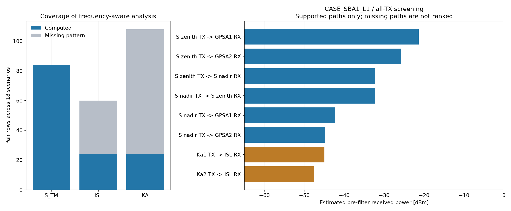

# RFI 간섭 해석 결과 보고서

작성 기준: 2026-10-04, GNU Octave 9.2.0. 분석 실행·수치 적분은 Octave에서 수행했다. Python은 CSV 검증·출처 정리·보고서와 그림 생성에만 사용했다.

**6개 안테나 조합 × 3개 시나리오 = 18개 시나리오, 총 252개 안테나 간 TX→RX 경로를 평가했다. 132개 경로는 대역별 방향 이득으로 전력 계산을 완료했고, 120개는 수신 대역 외 패턴 부족으로 미판정이다.** 확보된 경로는 모두 이상적인 기본파 PSD와 수신 필터에서 대역 비중첩이며, 필터 뒤 기본파 간섭은 0 W다. 이는 전체 RFI 적합이나 실제 수신기 보호 성능의 PASS가 아니다.

## 모델과 패턴 선택

- 케이스는 SBA1/SBA4 × GPS L1/L2/L5. 설치 위치는 nadir/zenith, GPSA1/2, KAA1/2, ISL을 각각 유지했다. S는 TM TX와 TC RX, L은 RX만, Ka는 TX만, ISL은 TX/RX다.
- SCREENING_ALL_TX는 등록된 모든 TX/RX 동시 활성 가정이다. NOM_NADIR_KAA1 / NOM_ZENITH_KAA2는 기존 임시 운용 정의이며 확정 운용 일정이 아니다. 활성 ID와 패턴 매핑은 `case_pattern_evidence.csv`에 기록했다.
- 승인된 installed pattern이 없으므로 자유공간을 우선했다. 작은 구조물의 S 잠정 설치 결과를 최종 패턴으로 사용하지 않았으며 추가 CST를 실행하지 않았다.
- baseline frozen 패턴은 56개 파일의 hash를 검증했다. 기존 엔진 결과는 `legacy_engine_reference.csv`에 비교용으로 보존했다. baseline 재구성 격자는 10°로 명시했으며 주 결과는 원래 1° 컷에서 실제 결합 방향을 직접 평가했다.
- 주 결과에서 S/L/ISL은 해당 TX 대역의 CST total RealizedGain을 사용했다. SBA1/SBA4의 frozen 참조 패턴 구분은 유지하되, 물리 CST S 형상이 공통이므로 이 경로의 주 계산값이 variant에 따라 동일할 수 있다. 제품 간 실측 차이를 해석했다고 주장하지 않는다.
- Ka TX는 frozen reflector reference gain을 사용했다. 이 자료를 total RealizedGain으로 재분류하지 않았다. Ka 포함 경로는 mismatch 미확인 상태의 혼합 reference screening이다. feed-only 결과로 reflector를 대체하지 않았다.
- 모든 방향 이득은 두 컷의 주기적 theta 보간 및 기존 `CutPatternAssembler.reconstructGain`을 이용한다. 임의 방위는 두 컷의 근사이며 완전 3D/측정/mesh 수렴 결과가 아니다. 지향은 현재 설치 기준값이며 Ka gimbal 가동 범위 최악 탐색은 수행하지 않았다.

## 계산 근거

좌표는 기존 `AntennaToAntennaFOV.relativeGeometry`와 local-to-body 회전을 사용했다. 원본 +Z에서 내부 antenna +X로의 변환은 `canonicalToAntenna`로 한 번만 적용했다. TX→RX 방향과 RX→TX 방향을 각각 평가했다. 최대 이득을 방향 이득 대신 쓰지 않았다.

각 주파수에서 λ=c/f, FSPL=20 log10(4πd/λ), S21=Gtx+Grx−FSPL을 계산했다. TX 포트 기준 PSD에 10^(S21/10)을 곱해 선형 W로 적분했고, 필터 뒤에는 추가로 Hrx(f)를 한 번 곱했다. 64→128 구간 midpoint 적분의 최대 변화는 5.55649e-06 dB로 0.1 dB 이내다. 서로 다른 계산 대역 사이의 gap 보간은 하지 않았다. RealizedGain에는 mismatch를 다시 차감하지 않았다. 별도 polarization 손실은 입력 근거가 없어 적용하지 않았다.

허용치=10 log10(k·290·B·10^(NF/10))+30+I/N_max. 필요한 광대역 거부량=max(0, 필터 전 적분 수신전력−허용치)다. 이 값은 요구 거부량 screening이며 실제 필터의 성능이나 blocking/P1dB 허용치를 뜻하지 않는다.

원거리 유효성은 기존 `FarFieldCouplingModel`의 양 안테나 2D²/λ와 5λ 조건을 사용했다. 미충족이면 FREE_SPACE_ASSUMED로 표시했다. LOS와 구조물 교차도 기록했지만 구조물에 임의 차폐 dB를 부여하지 않았다. BLOCKED 경로의 자유공간 수치는 구조효과 미포함 추정이며 엄밀한 상한 또는 측정된 결합으로 표현하지 않는다.

## 대역별 커버리지

| TX 대역 | 전체 경로 | 계산 완료 | 미판정 | 최대 필터 전 적분 전력 dBm (확보 경로만) |
| --- | --- | --- | --- | --- |
| S_TM | 84 | 84 | 0 | -21.317 |
| ISL | 60 | 24 | 36 | -58.882 |
| KA | 108 | 24 | 84 | -44.945 |

미판정: S·L의 Ka 대역 응답 및 L의 ISL 대역 응답이 없다. S의 Ka 대역 응답을 자기 TC 패턴으로, GPS의 ISL/Ka 응답을 자기 L-band 패턴으로 대신하지 않았다. 모든 송신 스펙트럼을 수신기 운용 중심에서만 평가한 결과도 사용하지 않았다.

## 주요 경로: CASE_SBA1_L1 / 전체 동시 활성

| TX → RX | 필터 전 전력 dBm | 요구 거부량 dB | 원거리 상태 | LOS |
| --- | --- | --- | --- | --- |
| S_TM_TX@SBA_ZENITH → GPS_L1_RX@GPSA_1 | -21.317 | 83.549 | FAR_FIELD_VALID | CLEAR |
| S_TM_TX@SBA_ZENITH → GPS_L1_RX@GPSA_2 | -25.760 | 79.106 | FAR_FIELD_VALID | CLEAR |
| S_TM_TX@SBA_ZENITH → S_TC_RX@SBA_NADIR | -32.288 | 91.677 | FAR_FIELD_VALID | BLOCKED |
| S_TM_TX@SBA_NADIR → S_TC_RX@SBA_ZENITH | -32.288 | 91.677 | FAR_FIELD_VALID | BLOCKED |
| S_TM_TX@SBA_NADIR → GPS_L1_RX@GPSA_1 | -42.314 | 62.552 | FAR_FIELD_VALID | BLOCKED |
| S_TM_TX@SBA_NADIR → GPS_L1_RX@GPSA_2 | -44.858 | 60.008 | FAR_FIELD_VALID | BLOCKED |
| KA_DLS_TX@KAA_1 → ISL_X_RX | -44.945 | 59.020 | FREE_SPACE_ASSUMED | CLEAR |
| KA_DLS_TX@KAA_2 → ISL_X_RX | -47.488 | 56.477 | FREE_SPACE_ASSUMED | CLEAR |

위 표는 확보된 응답 중의 순위다. 미판정 경로가 더 위험하지 않다는 뜻은 아니다. Ka 경로는 reflector reference gain/mismatch 한계가 추가로 있다. 확보 경로에서 큰 필터 전 입력이 있으면 실제 전단 blocking·compression·상호변조 확인이 필요하다. P1dB/IIP3·실제 방사 마스크·스퍼·고조파 정보가 없어 그 항목은 판정하지 않았다.

## 시나리오 요약

| 케이스 | 시나리오 | 전체/계산/미판정 | 최대 확보 입력 dBm |
| --- | --- | --- | --- |
| CASE_SBA1_L1 | SCREENING_ALL_TX | 22/12/10 | -21.317 |
| CASE_SBA1_L1 | NOM_NADIR_KAA1 | 10/5/5 | -42.314 |
| CASE_SBA1_L1 | NOM_ZENITH_KAA2 | 10/5/5 | -21.317 |
| CASE_SBA1_L2 | SCREENING_ALL_TX | 22/12/10 | -21.317 |
| CASE_SBA1_L2 | NOM_NADIR_KAA1 | 10/5/5 | -42.314 |
| CASE_SBA1_L2 | NOM_ZENITH_KAA2 | 10/5/5 | -21.317 |
| CASE_SBA1_L5 | SCREENING_ALL_TX | 22/12/10 | -21.317 |
| CASE_SBA1_L5 | NOM_NADIR_KAA1 | 10/5/5 | -42.314 |
| CASE_SBA1_L5 | NOM_ZENITH_KAA2 | 10/5/5 | -21.317 |
| CASE_SBA4_L1 | SCREENING_ALL_TX | 22/12/10 | -21.317 |
| CASE_SBA4_L1 | NOM_NADIR_KAA1 | 10/5/5 | -42.314 |
| CASE_SBA4_L1 | NOM_ZENITH_KAA2 | 10/5/5 | -21.317 |
| CASE_SBA4_L2 | SCREENING_ALL_TX | 22/12/10 | -21.317 |
| CASE_SBA4_L2 | NOM_NADIR_KAA1 | 10/5/5 | -42.314 |
| CASE_SBA4_L2 | NOM_ZENITH_KAA2 | 10/5/5 | -21.317 |
| CASE_SBA4_L5 | SCREENING_ALL_TX | 22/12/10 | -21.317 |
| CASE_SBA4_L5 | NOM_NADIR_KAA1 | 10/5/5 | -42.314 |
| CASE_SBA4_L5 | NOM_ZENITH_KAA2 | 10/5/5 | -21.317 |

수신기 합산은 선형 전력 합으로 `receiver_aggregates.csv`에 남겼다. 일부 경로 누락 시 INCOMPLETE_MISSING_RESPONSES이며 supported-only 값으로 표시했다. 미판정 값을 0 W로 채워 전체 PASS를 만들지 않았다. 비중첩 기본파의 −Inf dBm / +Inf margin은 이상 필터 모델의 정확한 0 W 표시일 뿐 실제 EMC 무한 여유가 아니다.

## SAR 영향성

SAR 패턴이 미결합이라 실제 SAR 송수신 절대 RFI는 NOT_EVALUATED다. 기존 SAR 위치에서 각 RX를 향하는 방향의 S/ISL 응답을 8.9/9.65/10.4 GHz에서 평가해 `sar_response_sensitivity.csv`에 90행을 기록했다. L 응답은 해당 대역에서 미확보다. 방향 EIRP=0 dBm당 RX 필터 전 입력 전달량 Gr−FSPL 및 열잡음 기준의 방향 EIRP 경계값을 별도 민감도로 제공했다. SAR 송신 이득·실제 전력·mask를 채워 넣은 실제 간섭값이 아니다. SAR 크기는 불명이라 이 자유공간 전파도 가정이다.

## 검증과 재현

- Octave 관련 테스트: 57 assertions 통과, 0 실패 (`octave_tests.log`). 전체 테스트 suite 실행을 주장하지 않는다.
- 입력 frozen 56개 hash 불변, 역할/자기 설치 제외/전력 수식/대역별 적분 refinement 검증 PASS (`validation.json`).
- 원본 컷에서 기록된 방향·주파수 이득을 독립 재구성해 대조한 최대 오차는 1.83826e-10 dB였다. 필터 전 선형 합산도 별도 대조했다.
- `frequency_direction_evidence.csv`는 64구간 검증 grid의 8448행이다. 최종 적분값은 128구간이고 두 grid 차이는 pair CSV에 기록했다. 샘플 컷 출처와 전체 보간 방법은 동일하다.
- 상태 분포: {'INPUT_MISSING': 120, 'IDEAL_FILTER_NO_FUNDAMENTAL_OVERLAP': 108, 'IDEAL_FILTER_NO_FUNDAMENTAL_OVERLAP_REFERENCE_GAIN_MISMATCH_UNKNOWN': 24}. 확보 경로의 전파 유효성 분포: {'FAR_FIELD_VALID': 108, 'FREE_SPACE_ASSUMED': 24}.
- 재실행: Octave에서 repo를 현재 디렉터리로 두고 `addpath('output/codex'); run_rfi_octave; run_rfi_octave('sar');` 실행. 이어 Python으로 `output/codex/build_report.py` 실행. 런타임 파일 경로는 `README.md`에 기록했다.
- `input_snapshot/`은 사용한 spacecraft 설정과 manifest 복사본이다. 원본 패턴·코드·CST 상태 hash는 `input_hash_manifest.csv`에 기록했다. 변경이 있으면 같은 결과의 재현으로 보지 않는다.

## 교차검증용 근거 파일

| 파일 | 검증할 내용 |
|---|---|
| case_pattern_evidence.csv | 6개 조합·3개 시나리오별 기능/설치/역할, baseline pattern key, 실제 원본 파일, 활성 TX/RX |
| frequency_direction_evidence.csv | 실제 주파수별 방향 이득, quantity, source CSV/CST case, FSPL/S21와 원거리 상태 |
| rfi_pairs.csv | 252개 경로의 거리/방향/LOS, 전력/허용치/거부량, 누락 이유, 적분 정확도 |
| receiver_aggregates.csv | 누락 경로를 명시한 수신기별 선형 전력 합산 |
| band_availability.csv / band_summary.csv | 8개 평가 대역 응답 가용성과 실제 TX 대역 결과 |
| sar_response_sensitivity.csv | SAR 대역 응답과 EIRP 매개변수 민감도; 실제 SAR 절대 간섭 아님 |
| legacy_engine_reference.csv | 기존 baseline 엔진 참고 결과; 대역 외 패턴 대체와 비교할 때 주의 |
| input_hash_manifest.csv / input_snapshot/ | 입력 버전과 분석 코드 근거 |
| octave_execution.log / run_metadata.json / validation.json | 실제 실행과 검사 근거 |

결론적으로 이번 결과는 자유공간·대역별 응답에 근거한 기본파 및 필터 전 입력 screening이다. 누락 패턴, 근거리/구조 효과, Ka 지향 범위, 실제 mask/전단 한계와 GNSS 최종 C/N0·J/S 기준을 확보하기 전 전체 RFI 적합은 미판정이다.
