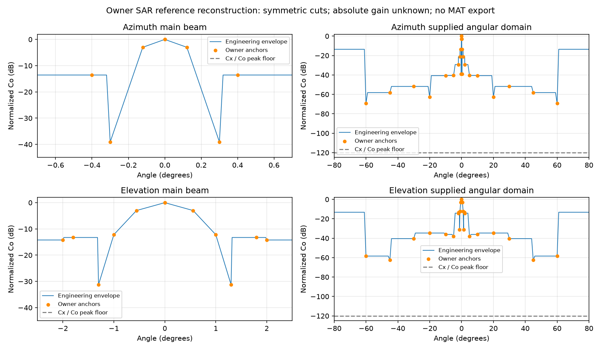

# RFI 설계 보고서 — Task 2 scope 및 SAR/ISL victim-only

## 1. Executive Summary

**Primary attacker는 S-TC TX와 Ka DLS TX뿐이다. ISL과 SAR는 victim only다.** S-TC → ISL은 victim PSD −137.7596 dBm/Hz, 최소 추가 억제 39.2410 dB, 첫 통과 40 dB다. S-TC → GPS L1/L2/L5의 기존 48.00/81.19/81.61 dB 결과를 유지한다.

S-TC → SAR의 정수 고조파는 SAR band와 겹치지 않는다. 일반 spurious는 별도 경로이며, normalized SAR envelope를 생성했으나 절대 peak gain과 실제 입사 방향의 side/back 응답이 없어 최종 PSD·억제 요구는 보류다.

Ka는 owner 지정 WR-42 / 70 W / 31 dBi reference를 사용한다. TE10 cutoff는 14.051 GHz, 총 EIRP reference는 49.451 dBW다. 유효 길이가 미확정이므로 감쇠는 dB/mm와 길이의 곱으로 표시하고, primary screening에는 cutoff credit을 주지 않았다. 기존 ITU spurious envelope 기반의 0-credit PSD 결과를 함께 제공한다. 이전 KAA 저주파 gain-bound는 sensitivity로만 보존했다.

| Attacker | GPS | S-TM RX | ISL RX | SAR RX |
| --- | --- | --- | --- | --- |
| S-TC TX | 분석 | 분석 | 분석 | generic spurious / harmonic 분리 |
| Ka DLS TX | cutoff route | cutoff route | cutoff route | cutoff route 보류 |
| ISL TX | 제외 | 제외 | 제외 | 제외 |
| SAR TX | 제외 | 제외 | 제외 | 제외 |

| S-TC TX victim | Victim PSD (dBm/Hz) | Limit (dBm/Hz) | 0 dB margin (dB) | Required (dB) | First PASS |
| --- | --- | --- | --- | --- | --- |
| GPS L1 | -130.00 | -178.00 | -48.00 | 48.00 | 60 dB |
| GPS L2 | -96.81 | -178.00 | -81.19 | 81.19 | 없음 (80 dB 초과) |
| GPS L5 | -96.39 | -178.00 | -81.61 | 81.61 | 없음 (80 dB 초과) |
| S-TM RX | -118.11 | -177.00 | -58.89 | 58.89 | 60 dB |
| ISL RX | -137.76 | -177.00 | -39.24 | 39.24 | 40 dB |

Actual S-TC TX의 legacy ID는 `S_TM_TX`, S-TM RX는 `S_TC_RX`다. L2/L5는 owner −10 dB mismatch와 기존 radiation envelope의 engineering bound이며 신뢰 불가 CST absolute gain은 사용하지 않는다. [Task 1 source·결합 근거](task1_lband_summary.csv)를 보존한다.

## 2. SAR reference pattern과 고조파 판정

| Cut | HPBW (°) | 3 dB points (°) | First null | Maximum sidelobe |
| --- | --- | --- | --- | --- |
| Azimuth | 0.242294 | ±0.121147 | −39.083 dB @ ±0.3° | −13.565 dB @ ±0.4° |
| Elevation | 1.112221 | ±0.556111 | −31.241 dB @ ±1.3° | −13.270 dB @ ±1.8° |

Owner 추출 Co 값으로 대칭 normalized envelope를 생성했다. Main beam은 exact half-power/null/sample anchors를 지나는 dB 선형 모델, side 영역은 adjacent higher upper envelope다. 60–80°의 미제공 tail은 제공 maximum sidelobe ceiling으로 덮었고 ±80° 밖은 외삽하지 않는다. 샘플만으로 모든 미관측 null/lobe를 복원하거나 true 3D로 확정하지 않는다. CSV는 evaluator 함수 `envelope(axis, angle)`의 engineering sampling snapshot이며 side 영역을 CSV 점 사이 선형 보간으로 다시 낮추면 안 된다.

Cx는 Co peak 대비 −120 dB floor와 XPD 120 dB provenance를 유지하고 primary에서는 Co만 사용한다. Cx 자기 peak로 normalization하지 않았다. 248.7072는 complex-field magnitude이며 dBi로 변환하지 않았다. 원본 MAT이나 원본 1601-point vectors는 읽거나 반출하지 않았다. 생성 CSV는 별도 engineering grid다. Elevation half-power 좌표로 계산한 1.112222°와 제공 HPBW 1.112221°의 차이 0.000001°는 입력 반올림 차이로 보존한다.

**Harmonic-only: NO_HARMONIC_OVERLAP.** Nominal 2.25 GHz의 4차는 9.0 GHz, 5차는 11.25 GHz로 SAR 9.3875–9.9125 GHz 밖이다. Nominal occupied band 및 legacy 2.2–2.29 GHz tuning interval을 정수 배수로 확장한 검사도 겹치지 않는다. 이는 generic spurious가 없다는 뜻이 아니다.

## 3. S-TC → SAR generic spurious

| TX installation | 거리 (m) | SAR polar angle (°) | Port coefficient (dBm/Hz) | 판정 |
| --- | --- | --- | --- | --- |
| S-TC TX @ SBA_NADIR | 3.13 | 85.78 | -113.64 | 절대 gain·입사 방향 응답 미확보 |
| S-TC TX @ SBA_ZENITH | 3.66 | 123.85 | -114.17 | 절대 gain·입사 방향 응답 미확보 |

계수 C는 ITU source −49.0206 dBm/Hz + 신뢰 가능한 S/SAR CST RealizedGain cut envelope − FSPL이다. `PSD_port = C + G_SAR_peak + P_normalized`, `Required = max(0, C + G_SAR_peak + P_normalized + 175)`로 필요한 입력을 분리했다. P_normalized나 G_peak에 임의 0 dBi를 넣지 않는다. SAR boresight는 frozen Panel 1 normal reference이며 실제 roll/scan도 확정되지 않았다. 두 실제 경로의 polar angle은 제공 ±80° 범위를 벗어난다. SAR −175 dBm/Hz criterion은 기존 NF=5 / I/N=−6 engineering baseline이다.

## 4. S-TC → ISL 결과와 scenario

S antenna @ ISL 및 ISL receiver @ ISL의 신뢰 가능한 frozen RealizedGain 결합을 그대로 사용했다. 기준은 −177 dBm/Hz다. TX spectral suppression과 receiver blocker rejection은 별개다.

| 추가 TX 억제 (dB) | Margin (dB) | 판정 |
| --- | --- | --- |
| 0 | -39.24 | 기준 초과 |
| 40 | 0.76 | 기준 충족 |
| 60 | 20.76 | 기준 충족 |
| 70 | 30.76 | 기준 충족 |
| 80 | 40.76 | 기준 충족 |

## 5. Ka maximum-EIRP / cutoff route

70 W = 18.450980 dBW, owner 31 dBi reference와 합쳐 **49.450980 dBW = 79.450980 dBm 총 EIRP**다. 31 dBi는 minimum/nominal reference이며 확인된 hardware maximum gain이 아니다. 따라서 owner screening reference와 실제 maximum 보증을 구분한다.

Owner 후속 지시에 따라 **WR-42, a=10.668 mm, b=4.318 mm, TE10 fc=14.051015 GHz**를 적용했다. [제조사 치수 도면](https://www.rflambda.com/pdf/wgantenna/RW42HORN20C.pdf)으로 내부 치수를 확인했다. L은 actual effective evanescent length이며 아직 미확정이다. 아래는 각 대역 상단 주파수에서의 최소 dB/mm다.

| Victim band | Band upper (GHz) | f / fc | α (Np/m) | Attenuation (dB/mm) | L_eff (mm) | Total cutoff (dB) |
| --- | --- | --- | --- | --- | --- | --- |
| L1 | 1.59 | 0.113017 | 292.60 | 2.541498 | 미확정 | 2.541498 × L_mm |
| L2 | 1.24 | 0.088095 | 293.34 | 2.547941 | 미확정 | 2.547941 × L_mm |
| L5 | 1.19 | 0.084620 | 293.43 | 2.548711 | 미확정 | 2.548711 × L_mm |
| S (2025–2110 MHz) | 2.11 | 0.150167 | 291.15 | 2.528881 | 미확정 | 2.528881 × L_mm |
| X (10.55–10.65 GHz) | 10.65 | 0.757952 | 192.10 | 1.668534 | 미확정 | 1.668534 × L_mm |
| SAR X | 9.91 | 0.705465 | 208.72 | 1.812888 | 미확정 | 1.812888 × L_mm |

[TE10 cutoff 식의 근거](https://www.ocw.mit.edu/courses/6-013-electromagnetics-and-applications-spring-2009/d9425aa2b1acd0c1fc121965ad7eafec_MIT6_013S09_lec16.pdf): air-filled rectangular guide에서 `fc=c/(2a)`, `alpha=sqrt((pi/a)^2-(2pi*f/c)^2)`, `A_cutoff=8.685889638*alpha*L_eff`다. 이는 **WAVEGUIDE_BELOW_CUTOFF_BOUND / ENGINEERING_BOUND; NOT_FULL_WAVE_VALIDATED**이며 ordinary filter loss와 구분한다. 실제 leakage/discontinuity 경로는 이 식으로 보증하지 않는다.

Repository의 circular CST surrogate body length 20 mm는 actual effective length의 확인값이 아니므로 WR-42 길이로 재사용하지 않았다.

총 EIRP를 직접 PSD로 나누지 않고 **기존 ITU RR Appendix3 / SM.329 space-station spurious limit**를 유지했다. 70 W에서 attenuation=min(43+10log10(70),60)=60 dBc / 4 kHz다. Conducted broadband-equivalent −47.5696 dBm/Hz에 owner 31 dBi reference를 결합하여 EIRP source는 **-16.569620 dBm/Hz**다. Discrete spur를 broadband noise로 바꾼 결과가 아니며, 측정 PSD도 아니다.

`EIRP_PSD_after = EIRP_PSD_source − A_cutoff`, `PSD_victim = EIRP_PSD_after + G_RX − FSPL`, `Required=max(0, PSD_victim−Limit)`다. 다만 ITU limit의 antenna-line 기준면과 effective guide의 source 기준면을 맞추기 전에는 추가 cutoff credit을 승인된 억제량으로 사용하지 않는다. 이번 숫자는 **0 dB cutoff credit의 conservative screening**이다.

| Ka victim | Source EIRP PSD (dBm/Hz) | RX gain − FSPL (dB) | 0-credit Victim PSD (dBm/Hz) | Required upper screen (dB) | First PASS |
| --- | --- | --- | --- | --- | --- |
| L1 | -16.57 | -79.62 | -96.19 | 81.81 | 없음 (80 dB 초과) |
| L2 | -16.57 | -55.64 | -72.21 | 105.79 | 없음 (80 dB 초과) |
| L5 | -16.57 | -54.91 | -71.48 | 106.52 | 없음 (80 dB 초과) |
| S (2025–2110 MHz) | -16.57 | -55.42 | -71.99 | 105.01 | 없음 (80 dB 초과) |
| X (10.55–10.65 GHz) | -16.57 | -70.42 | -86.99 | 90.01 | 없음 (80 dB 초과) |
| SAR X | -16.57 | 미판정 | 미판정 | 미판정 | 미판정 |

| Ka victim | RX gain − FSPL (dB) | Maximum radiated PSD (dBm/Hz) | Required suppression 연결 |
| --- | --- | --- | --- |
| L1 | -79.62 | -98.38 | source PSD − A_cutoff가 이 값 이하여야 함 |
| L2 | -55.64 | -122.36 | source PSD − A_cutoff가 이 값 이하여야 함 |
| L5 | -54.91 | -123.09 | source PSD − A_cutoff가 이 값 이하여야 함 |
| S (2025–2110 MHz) | -55.42 | -121.58 | source PSD − A_cutoff가 이 값 이하여야 함 |
| X (10.55–10.65 GHz) | -70.42 | -106.58 | source PSD − A_cutoff가 이 값 이하여야 함 |

| Victim | L_eff sufficient without added filter (mm) | 조건 |
| --- | --- | --- |
| L1 | 32.18 | uniform guide / matched upstream reference-plane assumption |
| L2 | 41.51 | uniform guide / matched upstream reference-plane assumption |
| L5 | 41.79 | uniform guide / matched upstream reference-plane assumption |
| S (2025–2110 MHz) | 41.50 | uniform guide / matched upstream reference-plane assumption |
| X (10.55–10.65 GHz) | 53.95 | uniform guide / matched upstream reference-plane assumption |

### 이전 KAA gain-bound와 새 route 비교

| Victim | Legacy gain-bound required (dB) | WR-42 route, 0-credit required (dB) | 변경 (dB) |
| --- | --- | --- | --- |
| L1 | 68.80 | 81.81 | 13.01 |
| L2 | 90.23 | 105.79 | 15.56 |
| L5 | 90.96 | 106.52 | 15.56 |
| S (2025–2110 MHz) | 93.96 | 105.01 | 11.04 |
| X (10.55–10.65 GHz) | 91.88 | 90.01 | -1.87 |

이는 모델·source envelope가 다른 screening 비교다. 신규 route는 victim-frequency KAA gain을 사용하지 않고 owner 31 dBi EIRP reference를 사용한다. 변화량을 실제 장비 격리 성능의 향상/악화로 해석하지 않는다.
길이 역산은 필요한 straight evanescent section의 engineering sizing이며 실제 설치 길이를 확정한 것이 아니다. 전 주파수·설치 경로에서 가장 큰 필요 길이를 사용했다. 실제 요구는 guide 길이·reference plane·leakage 검증 후 결정한다. 기존 KAA GAIN_BOUND_ONLY 숫자는 sensitivity로만 보존하며 cutoff primary 계산에는 사용하지 않는다.

## 6. 입력 한계·Secondary blocker

SAR absolute peak gain, ±80° 밖 normalized response/실제 orientation, WR-42 effective length와 upstream source reference plane이 필요하다. 기존 blocker −21.317 dBm(S-TC→GPS), −32.288 dBm(S-TC→opposite S-TM)은 secondary로 보존하고 TX unwanted suppression 요구에 사용하지 않는다. Receiver blocking/P1dB/IIP3 기준도 미확정이다.

## 7. Appendix / detailed validation

Freeze `8469e8903da83b6ebed014aae311f90855c31715`와 owner Task 1/2 입력만 사용했다. 다른 worker 결과를 분석 입력으로 쓰지 않았고 shared src/data/test를 변경하지 않았다. Additional CST simulation은 실행하지 않았다.

[scope 입력](emission_inputs/task2_owner_scope.json), [SAR anchors](sar_owner_pattern_anchors.csv), [SAR envelope](sar_reference_envelope.csv), [harmonic overlap](sar_harmonic_overlap.csv), [S→SAR spurious](stc_sar_spurious_results.csv), [Ka band cutoff](ka_cutoff_band_results.csv), [Ka pair 요구식](ka_cutoff_pair_requirements.csv), [primary pair](all_pair_required_suppression.csv), [scenario](design_filter_scenarios.csv), [validation](task2_validation.json)을 참조한다. Task 1의 inclusive primary는 [legacy_task1](legacy_task1/all_pair_required_suppression.csv), KAA gain bound는 [sensitivity](conditional_bound_required_suppression.csv)에 보존했다.

